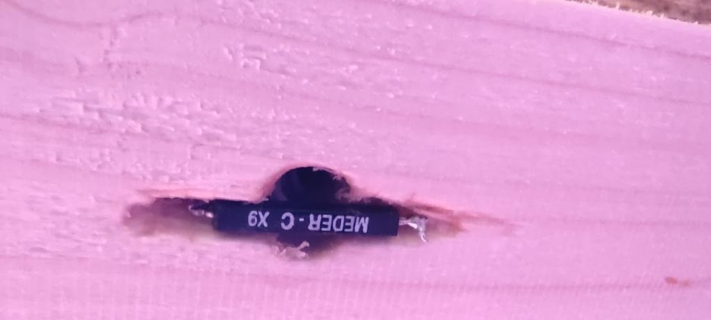

# Sauna-controller

<!-- Kurzbeschreibung -->
A fascinating and innovative project that implements a powerful sauna controller using ESPHome – smart, reliable, and highly impressive.

<!-- Inhaltsverzeichnis -->
- [Attention](#attention-working-with-line-voltage-is-very-dangerous-ensure-you-know-what-you-are-doing)
- [Sauna-controller](#sauna-controller)
- [Features](#features)
- [Components](#components)
- [System](#system)
- [Sauna lamp](#sauna-lamp)
- [Software](#software)
- [Circuit diagram](#circuit-diagram)
- [Things to do][#Things to do]
- [Inspiration](#inspiration)
- [Installation](#installation)
- [Usage](#usage)
- [Repository Structure](#repository-structure)
- [Contributing](#contributing)
- [License](#license)

# Attention: Working with line voltage is very dangerous! Ensure you know what you are doing!

# Sauna-controller
Sauna Controller with ESP8266/ESP32 and [ESPHome](https://esphome.io/) for integration with [Home Assistant](https://www.home-assistant.io/).

For about 60€, you get an awesome sauna controller!

The sauna controller is built from scratch with no additional components needed. Integration is done with Home Assistant, and the controller itself is built around the excellent [ESPHome](https://esphome.io/).

# Features
- Real PID controller
- Power and energy calculation
- Customizable
- No cloud dependency
- Remote access
- Expandable
- Affordable
- Reliable
- Easy to build
- Easy to use
- Open source

If you find a sauna controller with more features, let me know ;-)!

# Components
Only a few components are needed:

1. **The brain of the Sauna Controller**: A Wemos D1 ESP8266 or any other device running ESPHome.

2. **Temperature sensors**: At least one DS18B20 to measure the temperature in the sauna. My setup includes 4 DS18B20 sensors to measure temperature at different locations (top of the sauna, lower bench, sauna controller, and sauna lamp).

3. **Thermal fuse**: A crucial component. If something goes wrong and the heater overheats, the thermal fuse burns out and switches off the heater, cutting the voltage for the high current switches.

4. **High current/voltage switch to heat the sauna**: I chose SSR relays like 3 SSR-40DA. SSR relays are wear-free and allow for easy PID controller implementation without noise.

5. **Optional door sensor**: I have a reed contact in the sauna door. If the door is open, the controller can switch off the sauna. The controller resets a timer when the door is opened, which is useful for extended sauna sessions.

6. **Optional additional sensors**: I use various other sensors to measure temperature in the room, between the sauna wall and the room wall, and humidity.

7. **Sauna lamp**: The controller also drives WS2812b LEDs for the sauna lamp, allowing for fun lighting effects.

8. **Junction box, cables, and other small components**.

# System
!Attention! Working with line voltage is very dangerous! Ensure you know what you are doing!

The heart of a sauna is, of course, the heater. Most commonly used heaters in Europe use 3-phase power and have a power rating of over 3kW, with a current of less than 16A. A normal switch for 3 phases is sufficient. The SSR-40DA, even the cheap copies, work well. Most SSR-40DA relays do not switch at 3.3V, even if the control LEDs turn on. With a simple NPN transistor, the three SSR-40DA relays get 5V control voltage and switch correctly. I mounted the SSR-40DA on an aluminum plate and tested the temperature of the plate. In the junction box, the temperature is about 50°C with my 7.5kW heater during the heating phase, which is acceptable.

I decided to switch the heater's 3 phases together for the lowest cable dissipation. The "PWM" has a long period of about 60 seconds, and the SSR-40DA relays have no switching wear. For safety, it is crucial to have a thermal fuse in the sauna. If the controller hangs or another bug occurs, the sauna can overheat, potentially leading to a fire. I use a thermal fuse with a 120°C rating in the control voltage for the SSR-40DA.

The rest of the controller is very simple. One DS18B20 measures the temperature, and that's it. The rest is handled by the ESP8266 (an ESP32 is also possible). See the Software section for more details. This setup provides a sauna controller that is more flexible than most commercial controllers, but for less money!

With the door sensor, you get additional features. A reed contact and magnet make it simple to wire like a normal switch with an internal pull-up. For about 1€, you can measure different temperatures in the sauna or the room.

I measure the temperature and humidity between the sauna wall and the room wall. The software calculates the dew point. If the dew point falls below the temperature, it can result in mildew. This allows me to react before mildew forms.

# Sauna lamp
A normal sauna lamp with a light bulb is not suitable for me. The biggest problem is the heat. Saunas with 100°C and LEDs don't work well together. I built a lamp with WS2812 LEDs, designed like an infinity lamp. The lamp dissipates heat with a large aluminum plate mounted on the outside wood. An acrylic "window" faces the sauna. With a temperature sensor in the lamp, it is possible to switch off the lamp before the LEDs overheat.

# Software
The sauna controller's entire UI is in [Home Assistant](https://www.home-assistant.io/). This is very convenient, as it prevents kids from accidentally turning on the sauna while playing in the sauna room. The software running on the controller is built with the excellent [ESPHome](https://esphome.io/). The configuration is in the sauna_controller.yaml file and is easily customizable for different setups.

In the Home Assistant frontend, you can set the temperature, switch the sauna on, and receive notifications when the sauna is ready. The controller itself manages the temperature without Home Assistant. If Home Assistant crashes, the sauna will not overheat. The controller regulates the heater with a PID controller, which works great. Compared to a simple two-point controller, the temperature is very stable. With a two-point controller, the temperature variation in the sauna is about 8°C. My heater makes noise when it switches off and on with a two-point controller, but with the PID controller, it is practically noiseless.

The PID constants are calculated with autotune. The constants are suitable for my sauna but can be optimized for different setups.

The controller also calculates the actual power needed for the sauna and integrates the power for the total energy consumption. This allows you to calculate the costs for your sauna sessions ;-).

With the door sensor, the timer resets if the door is opened. This is very convenient, as you don't need to remember to reset the timer. If you forget to close the door, the sauna will switch off.

I can measure different temperatures. Building a LED lamp for the sauna without overheating the LEDs was challenging. With a temperature sensor in the lamp, I was able to test if the heat dissipation was sufficient. The second attempt was successful ;-).

I've tried my best to comment the easy YAML config file, so it's easy to understand. It can be a good starting point for your own implementation.

# Circuit diagram
This is very simple. Normally, it is not needed, and the ESPHome YAML file is sufficient. But for reference, here is the circuit diagram:

## Circuit Diagram Explanation
1. **ESP8266/ESP32**: The brain of the controller, running ESPHome.
2. **SSR Relays (SSR-40DA)**: Used to switch the high current needed for the sauna heater. Controlled by the ESP8266/ESP32 through a transistor to provide the necessary control voltage.
3. **Temperature Sensors (DS18B20)**: Placed at various points to monitor the temperature inside the sauna (one for the pid at the seeling), optinal on the heatsink, and optinal in the room.
4. **Thermal Fuse**: !IMPORTANT! Provides a safety mechanism to cut off power if the temperature exceeds a safe limit.
5. **Door Sensor**: Optinal a reed switch that detects if the sauna door is open or closed.
6. **Sauna Lamp (WS2812 LEDs)**: Provides lighting inside the sauna with fun effects, controlled by the ESP8266/ESP32.
7. **Power Supply**: Provides the necessary power to the ESP8266/ESP32 and other components.

# Things to do
With the door contact, it would be possible to measure the time for a sauna session. A simulated sand clock with LEDs like WS2812 would be nice. Find more things to automate, such as switching off the room climate if the sauna is running, etc.

Very nice projects!

## Installation
- Flash the firmware with [ESPHome](https://esphome.io/).
- Connect your ESP8266/ESP32 device according to the pin mapping.
- Follow the on-screen instructions from Home Assistant and adjust settings in the YAML files as needed.

## Usage
- Integrate the controller with Home Assistant for easy control.
- Use the web interface to set target temperatures, view sensor status, and monitor energy consumption.
- The minimal version (sauna_simpler.yaml) is great for a lean setup, while sauna_controller.yaml offers extra features if you want advanced functionality.

## Repository Structure
- README.md – Project overview and documentation.
- sauna_simpler.yaml – Minimal configuration for essential operation.
- sauna_controller.yaml – A more feature-rich configuration with extra sensors and extras.
- images/ – Contains photos and the circuit diagram.

## Contributing
We welcome improvements!  
If you have suggestions or bug fixes, please open an issue or a pull request.

# Inspiration
This project was heavily inspired by:

https://github.com/bastiaanterhorst/sauna-automation  
https://github.com/quicklywilliam/saunakit

