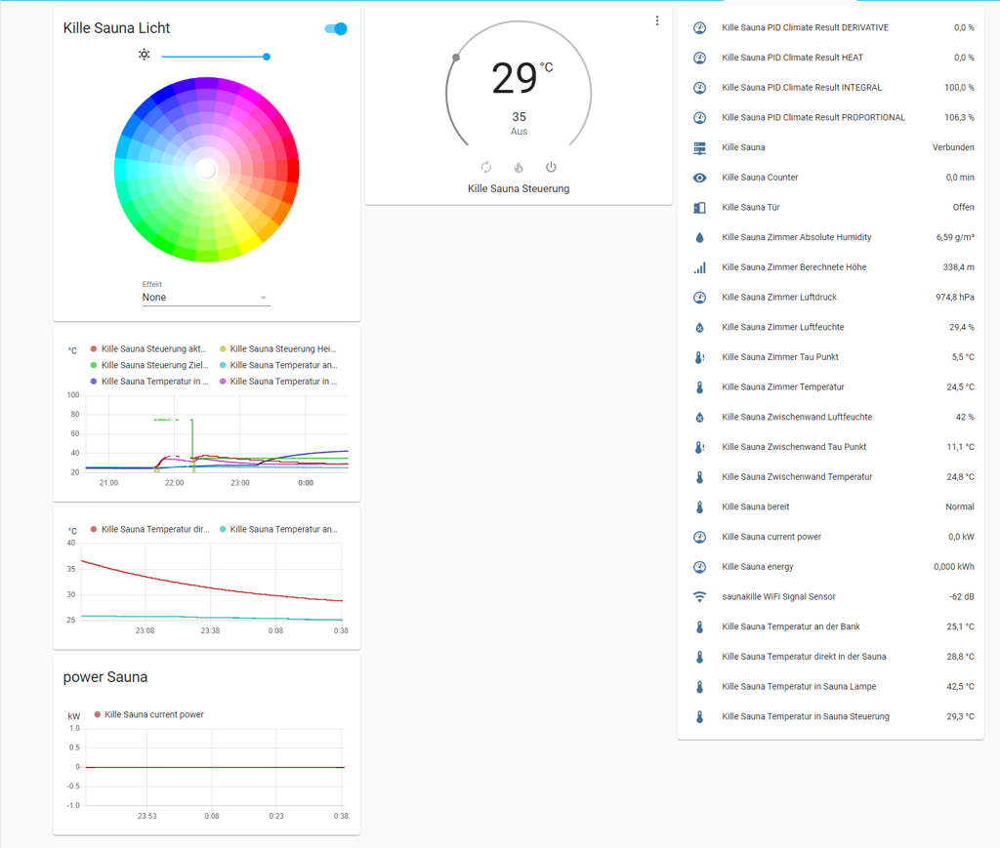

#Attention it is very dangerous to work with line voltage! You should know what you do!

# Sauna-controller
Sauna Controller with esp8266 and [ESPHome](https://esphome.io/) for a integration in [Home Assistant](https://www.home-assistant.io/) 

The big advantage you get for about 60€ a sauna controller that is awesome!

The sauna controller is build up from scratch. No additional components are needed.
The integration is done with Home Assistant. The controller itself is built around the awesome [ESPHome](https://esphome.io/).

# features
- real PID controller
- calculate the power and energy
- customizable
- no cloud
- remote access
- expandable
- cheap
- reliable
- easy to build
- easy to use
- open source

If you find a sauna controller with more features give me a hint ;-)!

# components
There are only a few components needed:

1. **The brain of the Sauna Controller** A Wemos D1 a ESP8266 microcontroller running ESPHome

2. **temperature sensors** at least one DS18B20 to measure the temperature in the Sauna. In my setup there are 4 DS18B20. So I'm able to measure the temperature in different places (at the top of the Sauna, at a bench, in the Sauna Controller and in the fancy Sauna lamp)

3. **Thermal fuse** a very important thing. If something goes wrong and the heater heats the thermal fuse burns up and switch off the heater. Its a very simple part and cuts the voltage for the high current switches

4. **a high current/voltage switch to heat the sauna with the heater** I choose a SSR relay like 3 SSR-40DA. A SSR relay is wear-free. It is easy possibility to build up a PID controller with it and without noise.

5. **optional door sensor** I've a reed contact in the sauna door. If the door is open the controller can switch off the sauna. The controller reset a timer when the door is opened. That is cool if you use the sauna the hole day or a longer time and the normal timer will switch off the sauna.

6. **optional more sensors** I use different other sensors to measure the temperature in the room, between the sauna wall and the room wall including humidity.

7. **Sauna lamp** the controller with the brain is a bit bored with only the PID controller. So another task for the controller is to drive WS2812b LEDs for the sauna lamp. It can do funny effects.

8. **junction box cables and so on** there are many other small things

# System 
!Attention! it is very dangerous to work with line voltage! You should know what you do!
The heart of a sauna is of course the heater. The most heater in Europe use 3 phase and have a power >3kW. The current is <16A. I normal switch for 3 phases is enough. The SSR-40DA even the cheep copies fit very well. The most SSR-40DA switch not at 3.3V even if the control LEDs switch on (it took me 2h to figure it out and fix it...). With a simple NPN transistor the three SSR-40DA get 5V control voltage and switch correct. I mounted the SSR-40DA on an aluminum plate and for testing I measure the temperature of the plate. In the junction box the temperature is about 50°C with my 7.5kW heater during the heating phase, that’s okay.
I have thought how to switch the heater, but in my opinion the best way is to switch the 3 phases together. The dissipation in the cable is in this case the lowest.
The "PWM" has a long time with a period of about 60s and the SSR-40DA no switching wear.
For safety it is very important to have a thermal fuse in the sauna. If the controller hangs or another bug the sauna can overheat. This can lead to a fire! I use a thermal fuse with 120°C in the control voltage for the SSR-40DA.

The rest of the controller is very simple. One DS18B20 to measure the temperature and that’s it. The rest is in the ESP8266 (of course a ESP32 is also possible). See the Software part.
You get at this point a sauna controller that is more flexible than the most controller you can buy but for less money!
But that’s to simple, there is more possible!

With the door sensor you have very nice features. This is very simple with a reed contact and a magnet. The wiring is like a normal switch with the internal pull up.
For about 1€ you can measure different temperatures in the sauna or in the room.

I measure the temperature and humidity between the sauna wall and the room wall. The software calculates the dew point. In case the dew point falls below the temperature this can result in mildew. If I'll get problems, I can react bevor I get mildew.

# Sauna lamp 
A normal sauna lamp with a Light Bulb is not suitable for me.
The biggest problem is the heat. Sauna with 100°C and LEDs don't work together.
I build up a lamp with WS2812 LEDs. The lamp is like a infinite lamp build.
The lamp dissipates the heat with a big aluminum plate mounted on the outside wood. To the sauna is a acrylic "window". With the temperature sensor in the lamp, it is possible to switch off the lamp bevor the LEDs overheat.

# Software
The sauna controller has the hole UI in the [Home Assistant](https://www.home-assistant.io/). In my case this is very good, so the kits can not switch the sauna on by playing in the sauna room.
The software that runs on the controller is build with the awesome [ESPHome](https://esphome.io/). The configuration is in the sauna_controller.yaml. It is easy customizable to another setup.
In the Home Assistant frontend you can set temperature, switch the sauna on and get a notification if the sauna is ready.
The controller itself controls the temperature without Home Assistant. If Home Assistant crashes, the sauna will not overheat.
The controller regulate the heater with a PID controller. That works great, in comparison to a simple two point controller the temperature is very constant. With a simple two point controller the temperature various in the sauna is about 8°C.
My heater make noise when it switch off and on with a two point controller. With the PID controller it is really silence.
The PID constants are calculated with autotune. The constants are suitable for my sauna but can be optimate for different setup.

The controller also calculate the actual power needed for the sauna and integrate the power to the needed energy. Now it is possibly to calculate the costs for the fun ;-).
With the sensor in the door, the timer will reset if the door is opened. That’s very cool, no need to remember to reset the timer. If you forgot to close the door, the sauna will switch off.
I've measure different temperatures. It was not easy to build a LED lamp for the sauna and not to overheat the LEDs. With a temperature sensor in the lamp I was able to test it if the heat dissipation is enough. In the second step it was enough ;-).

I've tried my best to commit the easy yaml config file good enough. It can be a good start point for a own implementation.

# circuit diagram
This is very easy. Normally its not needed and the ESPHome yaml file is enough. 
But for reference the circuit diagram:

# things to do
With the door contact would be possible to messure the time for a sauna Sauna passage. A simulated sand clock with LEDs like WS2812 would be nice.
Find more things to automate, switch off the room climate if the sauna is running.
etc.

# Inspiration
This projekt was heavily inspired by: 

https://github.com/bastiaanterhorst/sauna-automation

https://github.com/quicklywilliam/saunakit

Very nice projekts!

